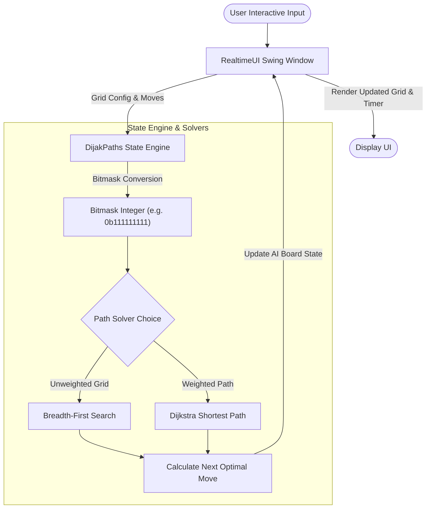

# PuzzleForge Architecture Diagram

```mermaid
flowchart TD
    User([User Interactive Input]) --> UI[RealtimeUI Swing Window]
    UI -->|Grid Config & Moves| Engine[DijakPaths State Engine]
    
    subgraph State Engine & Solvers
        Engine -->|Bitmask Conversion| State["Bitmask Integer (e.g. 0b111111111)"]
        State --> Solver{Path Solver Choice}
        Solver -->|Unweighted Grid| BFS[Breadth-First Search]
        Solver -->|Weighted Path| Dijkstra[Dijkstra Shortest Path]
        BFS --> OptimalMove[Calculate Next Optimal Move]
        Dijkstra --> OptimalMove
    end
    
    OptimalMove -->|Update AI Board State| UI
    UI -->|Render Updated Grid & Timer| Screen([Display UI])
```
